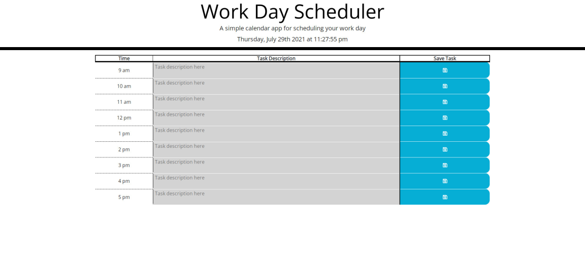

# thlanceScheduler
A simple task scheduler application that color codes blocks of time based on whether they are in the past/present/future while you're viewing the page. Typed tasks in the text boxes are saved to the browser's local storage and pulled on page refresh.

Screenshot:

URL: https://thlancegit.github.io/thlanceScheduler/